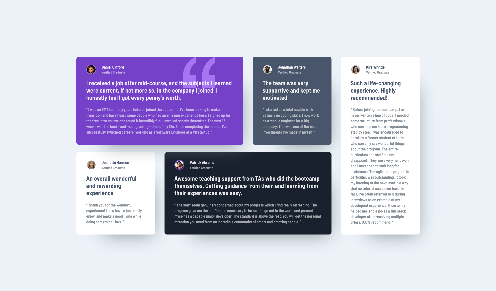

### Screenshot



### Built with

- Semantic HTML5 markup
- CSS custom properties
- Flexbox
- CSS Grid

### What I learned

I'm still uncomfortable with creating layouts using grid and flexbox. However, I've found this layout to be quite straightforward. It has been a great example for me to get comfortable with the concept.

I learned a neat trick to center items:

```css
body {
  display: grid;
  place-items: center;
}
```

I've also learned how to position images behind a text using the z-index.

In this project, the image is positioned absolutely with a negative z-index.

```css
#big-quotation {
  position: absolute;
  z-index: -1;
}
```

### Continued development

- Flexbox and Grid

### Useful resources

- [A Complete Resource to CSS Grid](https://www.example.com)
